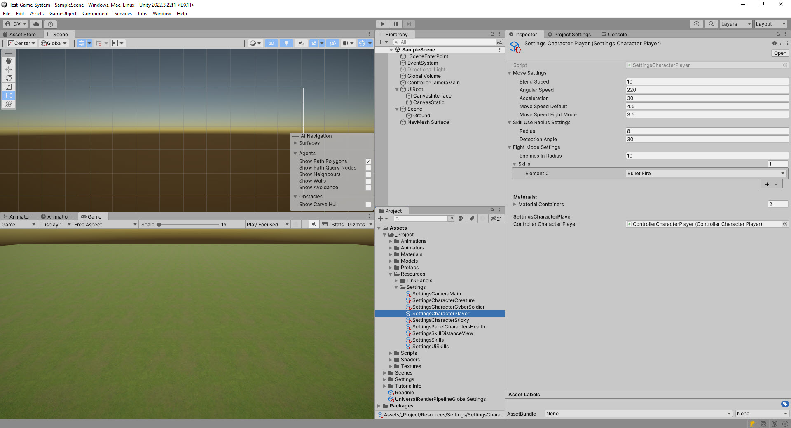
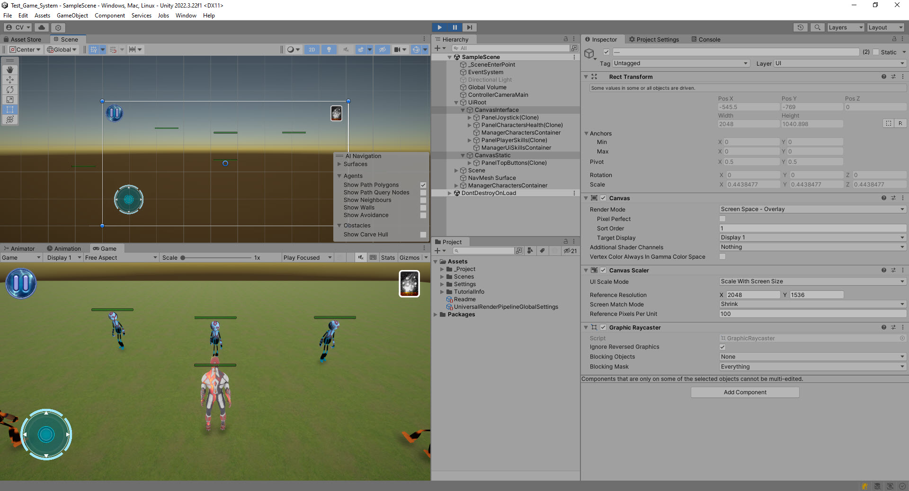
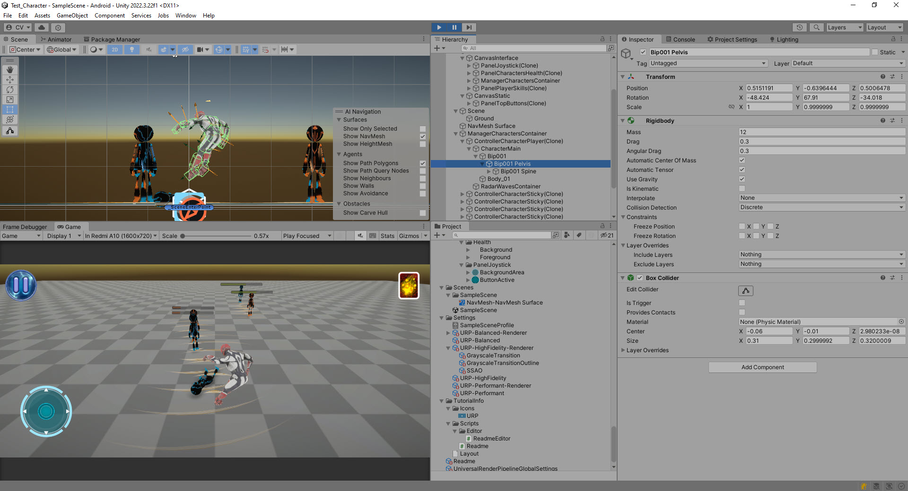
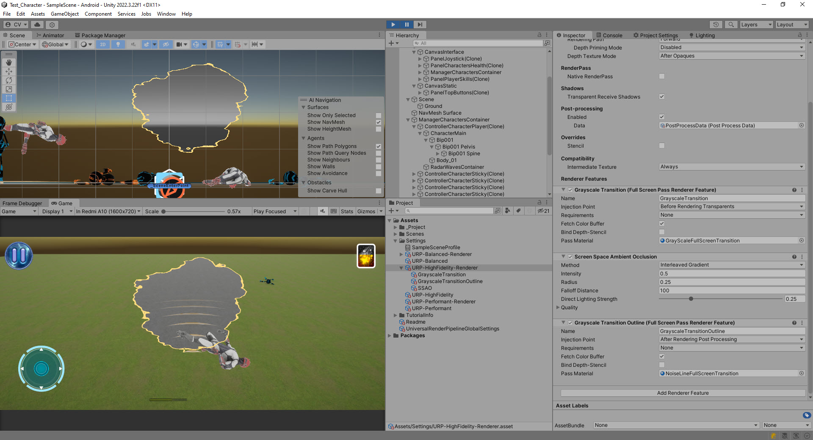
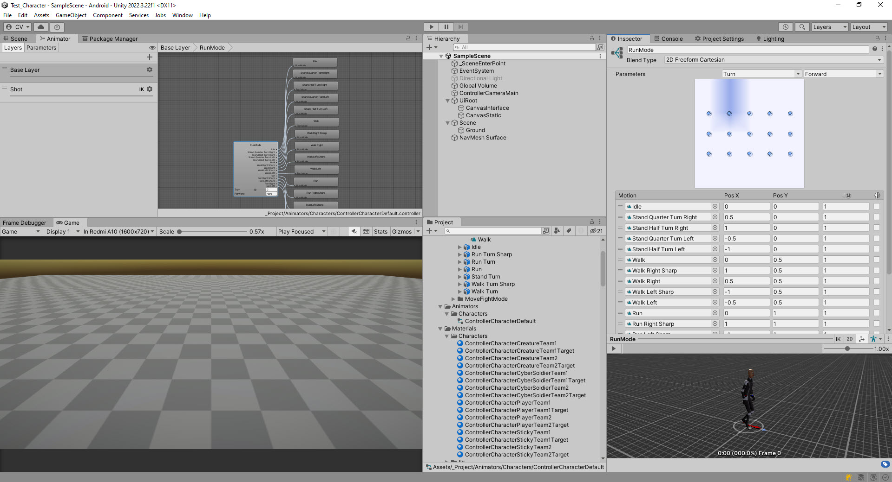
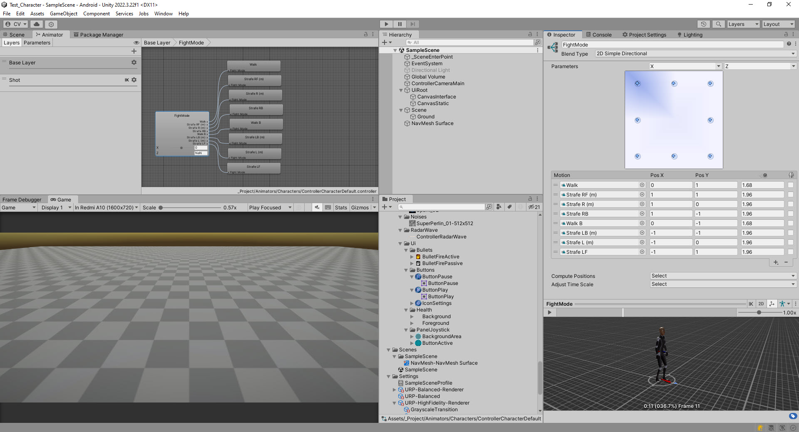
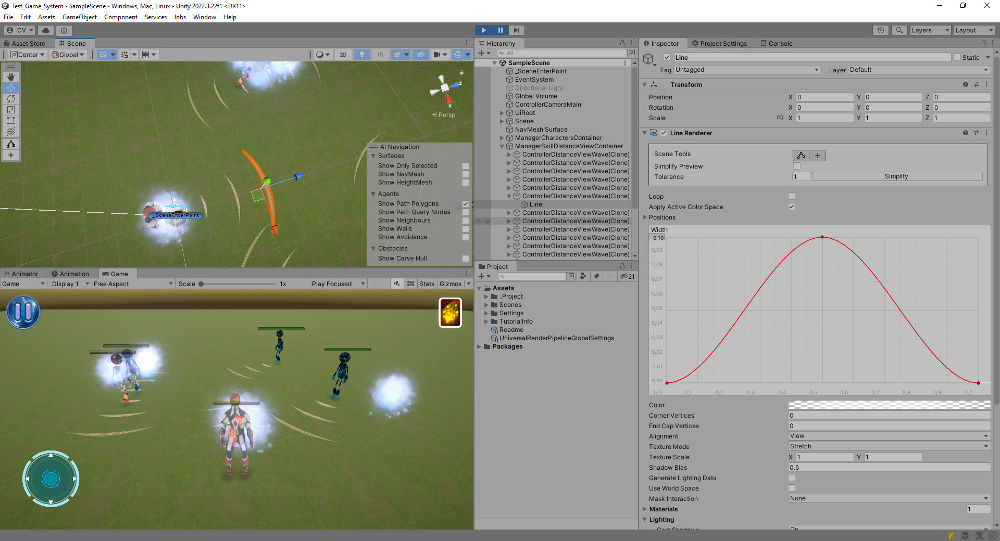

# Test_Game_System
Unity Game Control System

## Unity Patterns Used:
- Single Entry Point.
- Object Pool.
- Single Update Method.
- Canvas Segregation.

## Features:
- Full project initialization and loading through dependency injection.
- All settings moved to resources for Level Designers.
- Real-time setting adjustments that immediately impact game behavior.
- Pause by stopping Update() calls instead of setting Time.timeScale = 0.

## Unity Functionalities Used:
- NavMesh
- Ragdolls
- URP Draw Order Change
- Animator Blend Type 2D Freeform Cartesian
- Animator Blend Type 2D Simple Directional
- Particles
- Line Renderer

## Single Entry Point
- **Initialization of the entire project in one place for flexible modification:**
```
public class SceneBattle : SceneBase, IActiveUpdate
{
	protected override void InitializeInherit()
	{
		this.sceneComponentPlayerDieEffect = this.GetComponent<SceneComponentPlayerDieEffect>();
		
		var settingsCameraMain = this.GetSettings<SettingsCameraMain>();
		
		this.managerCharacters = this.GetManager<ManagerCharacters>();
		var managerBullets = this.GetManager<ManagerSkills>();
		this.managerSkillDistanceView = this.GetManager<ManagerSkillDistanceView>();
		
		this.managerCharacters.SetControllerCameraMain(this.controllerCameraMain);
		this.managerCharacters.SetManagerBullets(managerBullets);
		
		this.controllerCameraMain.SetSettingsCameraMain(settingsCameraMain);
		
		this.CreatePanelTopButtons();
		
		this.CreatePlayer(true);
		this.CreateEnemies();
		this.CreateAllies();
	}
}
```

## Object Pool
- **Reusing objects to avoid repeatedly creating identical instances:**
```
public abstract class ManagerBase
{
	private PoolContainer<T> GetPoolContainer<T>() where T : IPoolObject
	{
		...
	}
}

public class PoolContainer<T> : PoolContainerBase where T : IPoolObject
{
	protected readonly List<IPoolObject> poolObjects;
	private event System.Func<IPoolObject> OnFuncCreteObject;
	...
}
```

## Single Update Method
- **To reduce the stack trace for the Update method call of each active object:**
```
public interface IActiveUpdate {}
public interface IActiveLateUpdate {}
public interface IActiveFixedUpdate {}

public class ControllersHandler
{
	private List<IActiveUpdate> controllersActiveUpdate;
	private List<IActiveFixedUpdate> controllerActiveFixedUpdate;
	private List<IActiveLateUpdate> controllerActiveLateUpdate;
	
	public void Update()
	{
		for (int i = this.controllersActiveUpdate.Count - 1; i >= 0; i--)
		{
			var controller = this.controllersActiveUpdate[i];
			if (!controller.IfPaused())
			{
				controller.UpdateInherit();
			}
		}
	}
}
```

## Game Settings for Level Designers
- **All settings moved to resources for Level Designers:**



## Canvas Segregation
- **To reduce the number of UI redraws during updates:**



## Ragdolls
- **To simulate a character's death:**



## URP Draw Order Change
- **Switch to grayscale after character's death:**



## Animator
- **2 types of animation blending implementations:**




## Line Renderer
- **Rendering rays to display the radius and angle of the field of view:**




